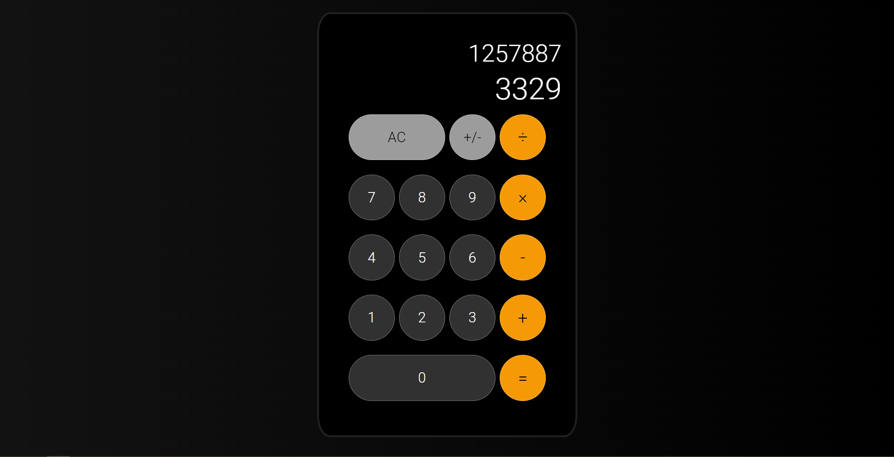

Simple calculator app made using HTML, CSS, and JavaScript. I've primarily been coding in Java and Kotlin recently, so the code may have a little Java OOP taste to it.

I have made a more advanced calculator using Kotlin in Android, which uses arbitrary precision decimals, but I mostly wanted to get some practice with something simple using the web dev basic kit.

